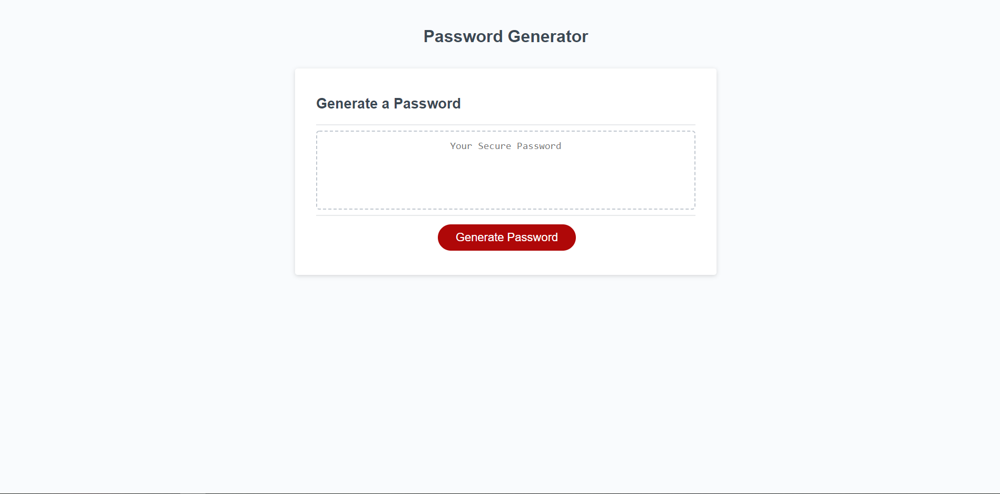

# Password Generator
An application that generates a secure password that meets the criteria provided by the user.

https://kg-phantom.github.io/password-generator/

## Password Length
The user is able to decide how long they would like their password to be (between 8 and 128 characters long).

## Character Types
The user is able to decide whether or not to include lowercase, uppercase, numeric, and/or special characters.

## Input Validation
After the user has submitted their input for the prompts, the input is validated to make sure the user has submitted a valid response. For example:
- If a password length less than 8 characters or more than 128 characters is submitted, the user will be prompted to resubmit.
- If a non-numerical input is submitted for the password length, the user will be prompted to resubmit.
- If no character types are selected, the user will be prompted to choose at least one and resubmit.

## Displaying the Password
The generated password is then printed on the page for the user to view and copy.

## Built With
- HTML
- CSS
- JavaScript
